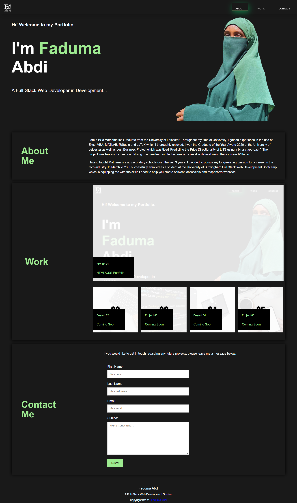

# Faduma Abdi Portfolio

## Project Description

This project is my portfolio page which I will be able to develop further as my experience in web development grows. 

The aim is for potential clients to know who I am and for me to showcase my skills and talents to employers looking to fill a part-time or full-time postion. The portfolio page will highlight my strongest work as well as the thought process behind it. Placeholder images and names have been used and will be replaced with future work.

The Portfolio Page currently has 6 main sections:

1. The Navigation Bar (with links to corresponding sections on the page)
2. Hero Header (developer's name and recent photo)
3. About Me (information about my journey so far)
4. Work (project sections with links)
5. Contact Form
6. Footer

* Alt text added to all images to improve accessibility. 
* Descriptive Title added to potentially increase web traffic.
* Em-dash punctuation used to improve user readibility.
* Responsive Web Layout that adapts to the viewport.

## Usage

This is currently a single-page responsive website which is optimised for larger and smaller screens.

Navigation bars at the top right corner of the website allow a user to navigate through the site to each section they would like to read.

Each placeholder image in the work section can be clicked. This will in future redirect a user to the deployed application.

## Links
[Click here to access the deployed website.](https://fadumaabdi.github.io/MyPortfolio/)

[Click here to access the files on the github repository.](https://github.com/fadumaabdi/MyPortfolio)

© 2023 Faduma Abdi

